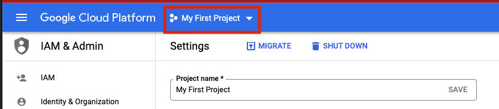
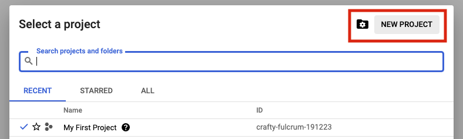
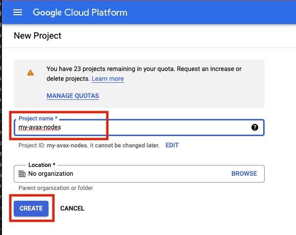
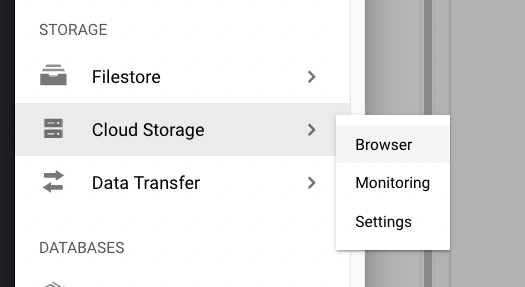
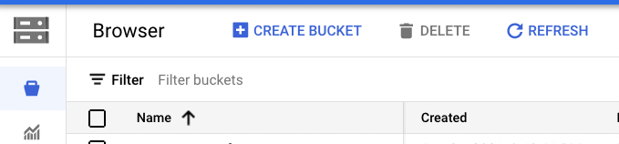

# Building Avalanche Validator on GCP

## Purpose

The purpose of this repository is to layout a known working GCP architecture for running an Avalanche Validator.

## Conventions

- `Items` highlighted in this manor are GCP parlance and can be searched for further reference in the Google documentation for their cloud products.

## Important Notes

- The machine type used in this documentation is for reference only and the actual sizing you use will depend entirely upon the amount that is staked and delegated to the node.

## Architectural Description

This section aims to describe the architecture of the system that the steps in the `Setup` section deploy when enacted. This is done so that the executor can not only deploy the reference architecture, but also understand and potentially optimize it for their needs.

### Project

We will create and utilize a single GCP `Project` for deployment of all resources.

#### Service Enablement

Within our GCP project we will need to enable the following Cloud Services:
- `Compute Engine`
- `IAP`

### Networking

#### Compute Network

We will deploy a single `Compute Network` object. This unit is where we will deploy all subsequent networking objects. It provides a logical boundary and securitization context should you wish to deploy other chain stacks or other infrastructure in GCP.

#### Public IP

Avalanche requires that a validator communicate outbound on the same public IP address that it advertizes for other peers to connect to it on. Within GCP this precludes the possibility of us using a Cloud NAT Router for the outbound communications and requires us to bind the public IP that we provision to the interface of the machine. We will provision a single `EXTERNAL` static IPv4 `Compute Address`.

#### Subnets

For the purposes of this documentation we will deploy a single `Compute Subnetwork` in the US-EAST1 `Region` with a /24 address range giving us 254 IP addresses (not all usable but for the sake of generalized documentation).

### Compute

#### Disk

We will provision a single 400GB `PD-SSD` disk that will be attached to our VM.

#### Instance

We will deploy a single `Compute Instance` of size `e2-standard-8`. Observations of operations using this machine specification suggest it is memory over provisioned and could be brought down to 16GB using custom machine specification; but please review and adjust as needed (the beauty of compute virtualization!!).

#### Zone

We will deploy our instance into the `US-EAST1-B` `Zone`

#### Firewall

We will provision the following `Compute Firewall` rules:

- IAP INGRESS for SSH (TCP 22) - this only allows GCP IAP sources inbound on SSH.
- P2P INGRESS for AVAX Peers (TCP 9651)

These are obviously just default ports and can be tailored to your needs as you desire.

## Setup Instructions

### Project

Login to the GCP `Cloud Console` and create a new `Project` in your organization. Let's use the name `my-avax-nodes` for the sake of this setup.

1. 
2. 
3. 

### Terraform State

Terraform uses a state file(s) to compose a differential between current infrastructure configuration and the proposed plan. You can store this state in a variety of different places, but using GCP storage is a reasonable approach given where we are deploying so we will stick with that.

1. 
2. 

**NOTE**

Depending upon how you intend to execute your terraform operations you may or may not need to enable public access to the bucket. Obviously, not exposing the bucket for `public` access (even if authenticated) is preferable. If you intend to simply run terraform commands from your local machine then you will need to open the access up.
I recommend to employ a full CI/CD pipeline using GCP Cloud Build which if utilized will mean the bucket can be marked as `private`. A full walkthrough of Cloud Build setup in this context can be found [here](https://cloud.google.com/architecture/managing-infrastructure-as-code)

### Terraform Configuration

1. If running terraform locally, please [install](https://learn.hashicorp.com/tutorials/terraform/install-cli) it.
2. In this repository, navigate to the `terraform` directory.
3. Under the `projects` directory, rename the `my-avax-project` directory to match your GCP project name that you created (not required, but nice to be consistent)
4. Under the folder you just renamed locate the `terraform.tfvars` file.
5. Edit this file and populate it with the values which make sense for your context and save it.
6. Locate the `backend.tf` file in the same directory.
7. Edit this file ensuring to replace the `bucket` property with the GCS bucket name that you created earlier.

If you do not with to use cloud storage to persist terraform state then simply switch the `backend` to some other desirable provider.

### Terraform Execution

Terraform enables us to see what it would do if we were to run it without actually applying any changes... this is called a `plan` operation. This plan is then enacted (optionally) by an `apply`.

#### Plan

1. In a terminal which is able to execute the `tf` binary, `cd` to the ~`my-avax-project` directory that you renamed in step 3 of `Terraform Configuration`.
2. Execute the command `tf plan`
3. You should see a JSON output to the stdout of the terminal which lays out the operations that terraform will execute to apply the intended state.

#### Apply

1. In a terminal which is able to execute the `tf` binary, `cd` to the ~`my-avax-project` directory that you renamed in step 3 of `Terraform Configuration`.
2. Execute the command `tf apply`

If you want to ensure that terraform does **exactly** what you saw in the `apply` output, you can optionally request for the the `plan` output to be saved to a file to feed to `apply`. This is generally considered best practice in highly fluid environments where rapid change is occuring from multiple sources.

### Why Bother?

Well, if you want another node just change the `total_instances` value to `2` and re-run `tf apply` and hey presto you have another machine that was configured in **exactly** the same way. No manual step = no manual pain.
You can now embed change into your CI/CD pipeline for your Avalanche nodes.